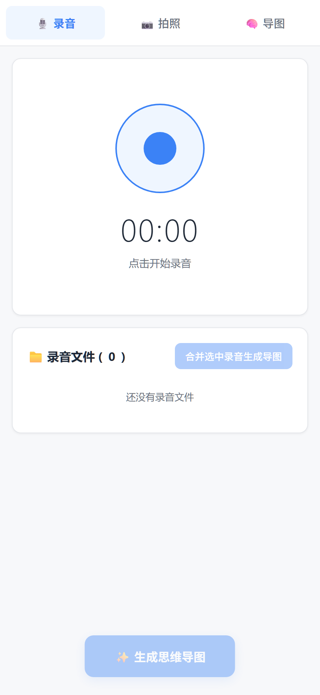
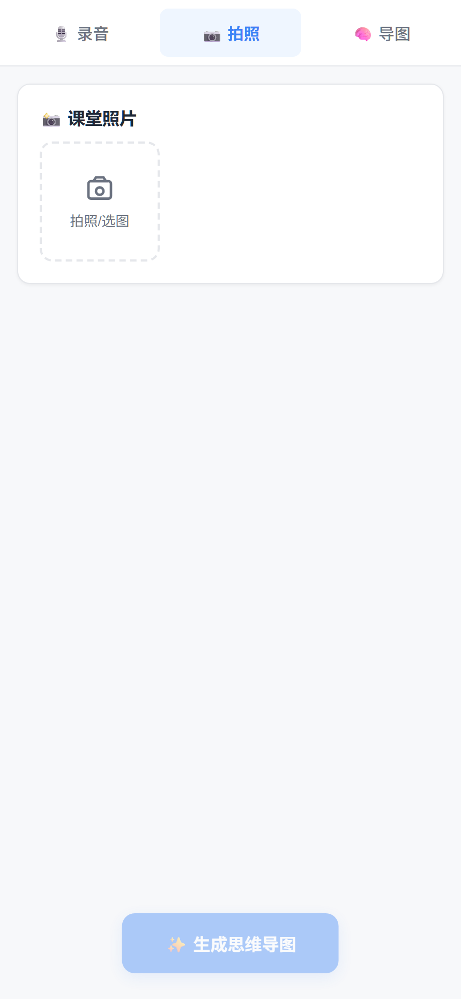
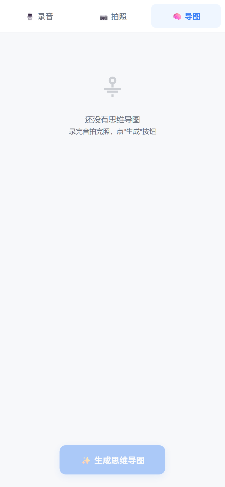

# classnote —— 课堂笔记助手

> 上课用手机录音、拍黑板/PPT，自动转写文字 + 提取知识点，一键生成**思维导图**。

两个入口，共用一套后端：

| 入口 | 特点 |
| --- | --- |
| 📱 **手机网页 PWA**（`/app/`） | 页面内直接录音、拍照；XMind 风格导图；可装到手机桌面 |
| 💬 **微信公众号** | 发语音/图片/文字 → 回复「生成」出导图；**零安装**，微信就是客户端 |

## 截图

| 🎙️ 录音 | 📷 拍照 | 🧠 导图 |
| --- | --- | --- |
|  |  |  |

> 手机尺寸（430×932 @2x）实时截图，由无头 Edge 抓取真实页面。

## 工作流

```
        ┌──────────────────────────────────────────┐
        │  ASR 语音转写 + 视觉识图 + LLM 生成导图      │
        └──────────────────────────────────────────┘
              ↑                            ↑
   ┌──────────┴───────────┐   ┌────────────┴──────────────┐
   │ ① PWA 网页端          │   │ ② 微信公众号               │
   │  🎙️录音 / 📷拍照 / 🧠导图│   │  发语音·图片·文字 → 「生成」 │
   └──────────────────────┘   └───────────────────────────┘
```

### PWA 三个标签页

- **🎙️ 录音**：页面内录音（浏览器不支持时降级为「调用手机录音机」上传）；可多段录音，勾选后合并生成
- **📷 拍照**：拍照/选图上传 → 视觉模型提取知识点
- **🧠 导图**：已生成导图列表与详情，XMind 风格渲染

### 微信公众号指令

| 你发 | 它做 |
| --- | --- |
| 🎙️ 语音 | 下载 → ASR 转写 → 记入本次笔记 |
| 📷 图片 | 下载 → 视觉模型提取知识点 → 记入本次笔记 |
| ✍️ 文字 | 直接当手动笔记记入 |
| `生成` / `生成导图` | 汇总全部内容 → LLM 生成思维导图（超 1800 字自动截断，微信单条上限 2048） |
| `清空` / `重置` | 清空本次累积内容 |
| `状态` / `进度` | 查看已记多少段语音、多少张图 |
| `帮助` / `help` | 使用说明 |

> **会话已持久化**：笔记落盘到 `data/wechat_sessions.json`，**服务重启不丢**；默认 7 天未活动的会话自动清理（`CLASSNOTE_SESSION_TTL` 可调）。

## 目录结构

```
classnote-backend/
├── main.py                    # FastAPI 入口（挂载 /app 静态前端）
├── config.py                  # 配置：密钥走环境变量或外部凭据文件
├── requirements.txt
├── routers/
│   ├── audio.py               # 录音上传 / 转写
│   ├── image.py               # 图片上传 / 识别
│   ├── mindmap.py             # 导图生成、列表、详情、改名
│   └── wechat.py              # 微信公众号：服务器校验 + 消息收发
├── services/
│   ├── asr_service.py         # 语音转写（DashScope qwen-audio）
│   ├── llm_service.py         # 总结 / 导图生成（DeepSeek，可回退百炼）
│   ├── vision_service.py      # 图片知识点提取（DeepSeek 多模态，可回退百炼）
│   ├── wechat_service.py      # 微信消息分发、媒体下载、签名校验
│   └── session_store.py       # 会话落盘（原子写 + 过期清理）
└── static/                    # PWA 前端（index.html + manifest + service worker）
```

## 用到的模型服务

| 环节 | 服务 | 说明 |
| --- | --- | --- |
| 语音转写 | 阿里云百炼 DashScope | `qwen-audio-3.0-asr-flash-filetrans` |
| 总结 / 导图 / 识图 | DeepSeek 官方 API | 默认 `deepseek-v4-flash-multimodal-exp`；无 Key 时回退百炼 |

## 配置（密钥不入库）

| 环境变量 | 用途 | 必填 |
| --- | --- | --- |
| `DASHSCOPE_API_KEY` | 阿里云百炼（ASR；备用视觉/导图） | ✅（ASR 必需） |
| `DEEPSEEK_API_KEY` | DeepSeek（总结/导图/识图） | 推荐 |
| `DEEPSEEK_MODEL` | 覆盖默认模型 | 可选 |
| `WECHAT_APPID` / `WECHAT_APPSECRET` | 微信公众平台 | 用微信入口时必填 |
| `WECHAT_TOKEN` | 微信服务器配置里的 Token（自定义校验串） | 用微信入口时必填 |
| `CLASSNOTE_DATA_DIR` | 运行数据目录（默认 `classnote-backend/data/`） | 可选 |
| `CLASSNOTE_EXPORT_DIR` | 「保存到本机」的目录（默认 `<数据目录>/exports/`） | 可选 |
| `CLASSNOTE_SESSION_TTL` | 会话有效期秒数（默认 604800 = 7 天） | 可选 |
| `DASHSCOPE_KEY_FILE` / `DEEPSEEK_KEY_FILE` / `DEEPSEEK_MODEL_FILE` | 可选：从「只放密钥/模型名的文件」里读取（便于用文件而非环境变量管理凭据） | 可选 |

> ⚠️ 所有密钥**一律通过环境变量或上述密钥文件传入**，源码中不写死任何密钥与绝对路径。

## 运行

```bash
cd classnote-backend
python -m venv .venv
.venv\Scripts\activate            # Linux/macOS: source .venv/bin/activate
pip install -r requirements.txt
uvicorn main:app --host 0.0.0.0 --port 8000
```

打开：

- 手机端界面 → `http://<本机IP>:8000/app/`
- 接口文档 → `http://127.0.0.1:8000/docs`

### 微信公众号接入

1. 微信公众平台 → 设置与开发 → 基本配置：拿到 `AppID` / `AppSecret`，自定义 `Token`
2. 服务器配置：URL 填 `https://<你的域名>/api/wechat`，Token 与 `WECHAT_TOKEN` 一致
3. 把这三个值配成环境变量后重启服务（`GET /api/wechat` 会自动完成微信的签名校验）

## 接口

| 端点 | 说明 |
| --- | --- |
| `POST /api/audio/upload` | 上传录音 → 转写 |
| `POST /api/image/upload` | 上传图片 → 提取知识点 |
| `POST /api/mindmap/generate` | 生成思维导图 |
| `GET /api/mindmap/list` | 导图列表 |
| `GET /api/mindmap/{id}` | 导图详情 |
| `PUT /api/mindmap/{id}/title` | 重命名导图 |
| `GET/POST /api/wechat` | 微信公众号校验 / 消息收发 |

## 已知限制

- **微信单条回复上限 2048 字**：导图超 1800 字自动截断并提示。
- **微信公众号仅测试号/服务号可自定义服务器**：订阅号无此权限。
- **ASR 走非实时文件转写接口**：长录音需等转写完成（前端有等待态）。
- 会话内容默认保留 7 天；如需长期保存请调大 `CLASSNOTE_SESSION_TTL`。

## 重新生成文档截图

```bash
# 先启动服务，再执行（需要 Edge + Node）
node tools/screenshot.mjs http://127.0.0.1:8000/app/ docs
```

脚本用无头 Edge + CDP 依次切换 `record` / `photo` / `mindmap` 三个标签页截图（430×932 @2x），
产出 `docs/pwa-1-record.png`、`docs/pwa-2-photo.png`、`docs/pwa-3-mindmap.png`。

## 关于本项目

- 本项目由 **AI（DeepSeek Harness）生成**，人类负责需求定义与验收。代码未逐字复制任何第三方项目。
- 密钥与路径全部外置：密钥走环境变量或密钥文件，导出目录走 `CLASSNOTE_EXPORT_DIR`。

## 数据流向与隐私

### 密钥怎么存

- 所有密钥**只从环境变量读取**（或用你指定的「密钥文件」），**源码中不含任何硬编码密钥**：
  `DASHSCOPE_API_KEY` / `DEEPSEEK_API_KEY` / `WECHAT_APPID` / `WECHAT_APPSECRET` / `WECHAT_TOKEN`。
- 密钥只用于向对应厂商请求时放进 `Authorization` 头（或作为换取微信 `access_token` 的参数），
  不会写入日志、不会回传到本服务以外的地方。
- 可选：用 `DASHSCOPE_KEY_FILE` / `DEEPSEEK_KEY_FILE` / `DEEPSEEK_MODEL_FILE` 指向「只放密钥/模型名的文件」，
  便于用文件而不是环境变量管理凭据。

### 数据去哪了

| 数据 | 本机落盘 | 是否外发 |
| --- | --- | --- |
| 录音（网页上传 / 微信语音） | `classnote-backend/uploads/` | ✅ **会上传到阿里云百炼 Files API**（转写所必需） |
| 图片（网页上传 / 微信图片） | `classnote-backend/uploads/` | ✅ 以 **base64 内联**在请求里发给 DeepSeek（无 Key 时回退百炼）做识图 |
| 转写文本 / 图片知识点 / 手打笔记 | 微信入口：`data/wechat_sessions.json` | ✅ 生成导图时作为提示词发给 DeepSeek（或回退百炼） |
| 生成的思维导图 | `mindmaps/`（列表与详情） | ❌ 不外发 |
| 「保存到本机」的导出 | `data/exports/`（可用 `CLASSNOTE_EXPORT_DIR` 改） | ❌ 不外发 |
| 「分享」的 Markdown | `shared/` | ❌ 不外发 |
| 微信通信 | — | 仅与 `api.weixin.qq.com` 交互（换取 `access_token`、下载你发来的语音/图片） |

**明确说明**：

- 除上表中的**阿里云百炼、DeepSeek、微信官方接口**之外，本项目**不向任何其他地方发送数据**；
  没有遥测、没有使用统计、没有第三方分析。
- 本地文件都在 `classnote-backend/` 内（已在 `.gitignore` 中排除），随时可自行删除。
- ⚠️ **敏感内容请注意**：录音会上传百炼、图片会发给 DeepSeek/百炼做识别——这两家都是**云端 API**，
  涉密或隐私材料不要用它处理；如需完全离线，可考虑自建本地 ASR/视觉模型并替换 `services/` 下的对应实现。

## 安全注意事项

- **密钥管理**：`DASHSCOPE_API_KEY` / `DEEPSEEK_API_KEY` / `WECHAT_APPSECRET` 等一律不入库，
  也不要提交到公开仓库；`config.py` 中不含任何硬编码密钥。
- **微信入口**：`GET/POST /api/wechat` 是对公网开放的（微信服务器要回调），
  请确保 `WECHAT_TOKEN` 足够随机，并只按微信官方文档配置 URL。
- **上传接口无鉴权**：`/api/audio/upload`、`/api/image/upload` 等没有访问控制，
  **不要直接把服务暴露到公网**；如需远程使用，请放在反向代理后并加鉴权。
- **会消耗额度**：转写与生成都会调用付费 API，公开部署时注意被滥用。
- **无担保**：本项目按「原样」提供，作者不对使用造成的损失负责。

## License

MIT，见 [LICENSE](LICENSE)。
